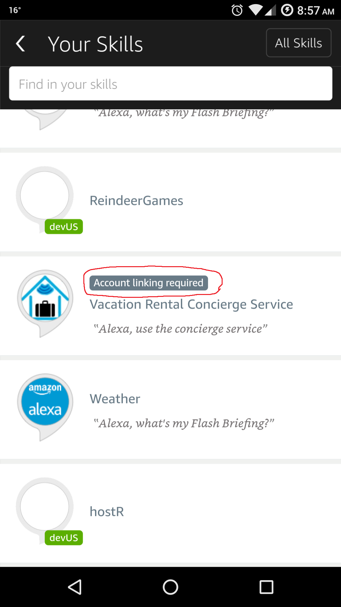

# hostR: Echo Assistant for Airbnb Rentals

Group 11: Caitlin Gruis, William Ho, David Winer, T.S. Yew

**Setup Instructions (Voice)**

**NOTE**: You can skip steps 1-13 below and simply email me at tsyew at berkeley dot edu so I can add you as a developer on my skill, which is much easier since the skill incorporates account linking. _For course graders, we have included Amazon account credentials with skill linking already enabled in our writeup to make testing easier._

1. Enter the `alexa` folder and find the `Archive.zip` file.
2. Upload the entire zipped archive as your lambda function in the AWS Console.
3. Copy the intents and utterances into the appropriate places in the developer console.
4. Enable account linking under the Configuration page.
5. Use `https://www.amazon.com/ap/oa` for the **Authorization URL**.
6. Use `(snipped)` for the **Client ID**.
7. Add the word `profile` as part of the scope.
8. Toggle **Auth Code Grant** for the **Authorization Grant Type**.
9. Select `HTTP Basic` for the **Client Authentication Scheme**.
10. Use `https://api.amazon.com/auth/o2/token` for the **Access Token URI**.
11. Use `(snipped)` for the **Client Secret**.
12. Leave everything under **Permissions** unchecked.
13. You may need to email your auto-generated **Allowed Return URLs** to (snipped) so that it can be authorized into the login API.
14. In the Alexa mobile app, navigate to the installed hostR skill and **link your Amazon account**:

**Setup Instructions (Website)**
1. Navigate to the `website` folder and run `pip install requirements.txt` to install dependencies.
2. From the `website` folder, run `python manage.py runserver`. Do not specify your own IP address or port because our login API only accepts `127.0.0.1:8000` from local hosts. 
3. Navigate to `127.0.0.1:8000` in your browser to start using the site.
4. Alternatively, navigate to [this Heroku page](https://pure-castle-17666.herokuapp.com) to use the live version.
